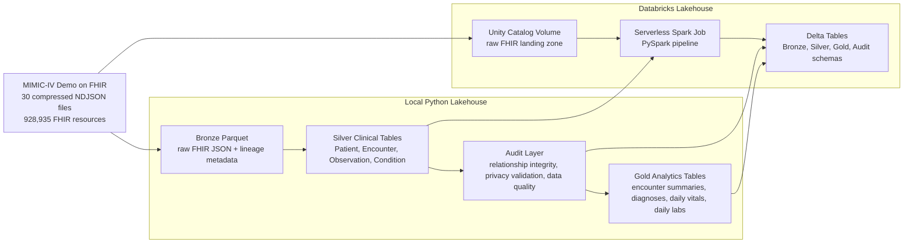

# Healthcare FHIR Lakehouse

Production-style healthcare data engineering project for transforming
FHIR-formatted clinical data into validated lakehouse analytics tables.

The project uses the
[MIMIC-IV Clinical Database Demo on FHIR v2.1.0](https://physionet.org/content/mimic-iv-fhir-demo/2.1.0/)
as a realistic public healthcare dataset and implements a Bronze -> Silver ->
Gold lakehouse pipeline with privacy-aware validation, data quality checks, local
orchestration, and Databricks/Spark/Delta cloud execution.

**Dashboard:** [View the interactive lakehouse dashboard](https://kevdev7.github.io/healthcare-fhir-lakehouse/)

## Highlights

* **Healthcare domain modeling:** FHIR Patient, Encounter, Observation, and
  Condition resources with parsed patient and encounter references.
* **Lakehouse architecture:** Bronze raw preservation, Silver clinical
  normalization, Gold analytics tables, and audit layers.
* **Data quality:** Row-count validation, required-key checks, relationship
  integrity checks, privacy checks, and publishable-output validation.
* **Privacy engineering:** HIPAA Safe Harbor-inspired audit of identifiers,
  dates, lineage fields, and text-like values.
* **Cloud execution:** Databricks serverless Spark job writing Delta tables to
  Unity Catalog schemas.
* **Static analytics dashboard:** GitHub Pages-ready dashboard built from safe
  aggregate Gold and audit outputs.
* **Engineering rigor:** Python package layout, Typer CLI, Makefile entry points,
  `uv` dependency management, Ruff linting, and 76 pytest tests.

## Stack

Local implementation:

* Python 3.11
* DuckDB
* pandas
* PyArrow / Parquet
* Typer CLI
* pytest
* Ruff
* uv

Cloud implementation:

* Databricks Jobs
* Apache Spark / PySpark
* Delta Lake
* Unity Catalog managed volumes
* Databricks Asset Bundles

## Dataset

Source: MIMIC-IV Clinical Database Demo on FHIR v2.1.0.

Profiled source volume:

| Resource area | Count |
| --- | ---: |
| Total FHIR resources | 928,935 |
| Patients | 100 |
| Encounters | 637 |
| Observations | 813,540 |
| Medication-related resources | 93,667 |

The raw dataset is not committed to this repository. Download it from PhysioNet
and place it at:

```text
mimic-iv-clinical-database-demo-on-fhir-2.1.0/fhir/
```

## Architecture



## Core Schema

```mermaid
erDiagram
    BRONZE_FHIR_RESOURCES {
        string resource_type
        string resource_id PK
        string source_file
        string resource_family
        string profile_url
        string source_dataset_name
        string source_dataset_version
        string ingested_at
        string raw_json
    }

    SILVER_PATIENT {
        string patient_id PK
        string source_patient_identifier
        string synthetic_patient_name
        string gender
        string birth_date
        string deceased_datetime
        string race
        string ethnicity
        string birth_sex
        string marital_status_code
        string source_file
        string resource_family
        string profile_url
        string source_dataset_name
        string source_dataset_version
        string bronze_ingested_at
        string bronze_resource_id FK
    }

    SILVER_ENCOUNTER {
        string encounter_id PK
        string patient_id FK
        string status
        string class_code
        string class_display
        string start_datetime
        string end_datetime
        string service_type_code
        string admit_source
        string discharge_disposition
        string discharge_disposition_display
        string source_file
        string resource_family
        string profile_url
        string source_dataset_name
        string source_dataset_version
        string bronze_ingested_at
        string bronze_resource_id FK
    }

    SILVER_OBSERVATION {
        string observation_id PK
        string patient_id FK
        string encounter_id FK
        string status
        string effective_datetime
        string issued_datetime
        string category_code
        string category_system
        string category_display
        string code
        string code_system
        string display
        string value_type
        string value
        string unit
        string specimen_id
        string source_file
        string resource_family
        string profile_url
        string source_dataset_name
        string source_dataset_version
        string bronze_ingested_at
        string bronze_resource_id FK
    }

    SILVER_CONDITION {
        string condition_id PK
        string patient_id FK
        string encounter_id FK
        string category_code
        string category_system
        string category_display
        string code
        string code_system
        string display
        string source_file
        string resource_family
        string profile_url
        string source_dataset_name
        string source_dataset_version
        string bronze_ingested_at
        string bronze_resource_id FK
    }

    GOLD_ENCOUNTER_SUMMARY {
        string encounter_key PK
        string patient_key
        string encounter_status
        string encounter_class
        int encounter_start_year
        int encounter_start_month
        int length_of_stay_hours
        int observation_count
        int condition_count
        int distinct_condition_count
        string discharge_disposition
    }

    GOLD_CONDITION_SUMMARY {
        string condition_code
        string condition_display
        string encounter_class
        string encounter_class_display
        int patient_count
        int encounter_count
        int condition_row_count
    }

    GOLD_VITALS_DAILY {
        string patient_key
        string encounter_key
        int event_day_index
        string measurement_name
        string unit
        int measurement_count
        float min_value
        float avg_value
        float max_value
    }

    GOLD_LABS_DAILY {
        string patient_key
        string encounter_key
        int event_day_index
        string measurement_name
        string unit
        int measurement_count
        float min_value
        float avg_value
        float max_value
    }

    BRONZE_FHIR_RESOURCES ||--o| SILVER_PATIENT : "Patient resource"
    BRONZE_FHIR_RESOURCES ||--o| SILVER_ENCOUNTER : "Encounter resource"
    BRONZE_FHIR_RESOURCES ||--o| SILVER_OBSERVATION : "Observation resource"
    BRONZE_FHIR_RESOURCES ||--o| SILVER_CONDITION : "Condition resource"

    SILVER_PATIENT ||--o{ SILVER_ENCOUNTER : "patient_id"
    SILVER_PATIENT ||--o{ SILVER_OBSERVATION : "patient_id"
    SILVER_PATIENT ||--o{ SILVER_CONDITION : "patient_id"
    SILVER_ENCOUNTER ||--o{ SILVER_OBSERVATION : "encounter_id"
    SILVER_ENCOUNTER ||--o{ SILVER_CONDITION : "encounter_id"

    SILVER_ENCOUNTER ||--o{ GOLD_ENCOUNTER_SUMMARY : "aggregates"
    SILVER_OBSERVATION ||--o{ GOLD_ENCOUNTER_SUMMARY : "observation_count"
    SILVER_CONDITION ||--o{ GOLD_ENCOUNTER_SUMMARY : "condition_count"
    SILVER_CONDITION ||--o{ GOLD_CONDITION_SUMMARY : "diagnosis rollup"
    SILVER_OBSERVATION ||--o{ GOLD_VITALS_DAILY : "vital measurements"
    SILVER_OBSERVATION ||--o{ GOLD_LABS_DAILY : "lab measurements"
```



Full table lineage, row counts, and design notes are documented in
`documentation/table_lineage.md`.

## Implemented Tables

Local Parquet outputs:

```text
output/bronze/fhir_resources/
output/silver/patient/
output/silver/encounter/
output/silver/observation/
output/silver/condition/
output/gold/encounter_summary/
output/gold/condition_summary/
output/gold/vitals_daily/
output/gold/labs_daily/
```

Databricks Delta outputs:

```text
workspace.healthcare_fhir_lakehouse_bronze.fhir_resources
workspace.healthcare_fhir_lakehouse_silver.patient
workspace.healthcare_fhir_lakehouse_silver.encounter
workspace.healthcare_fhir_lakehouse_silver.observation
workspace.healthcare_fhir_lakehouse_silver.condition
workspace.healthcare_fhir_lakehouse_gold.encounter_summary
workspace.healthcare_fhir_lakehouse_gold.condition_summary
workspace.healthcare_fhir_lakehouse_gold.vitals_daily
workspace.healthcare_fhir_lakehouse_gold.labs_daily
workspace.healthcare_fhir_lakehouse_audit.relationship_audit
workspace.healthcare_fhir_lakehouse_audit.privacy_audit
workspace.healthcare_fhir_lakehouse_audit.data_quality_report
```

## Validation Results

Local verification:

```text
make lint -> passed
make test -> 76 passed
```

Databricks cloud run:

| Evidence | Result |
| --- | --- |
| Job | `healthcare_fhir_lakehouse_pipeline` |
| Run status | `SUCCESS` |
| Raw files uploaded | 30 |
| Bronze rows | 928,935 |
| Silver Patient rows | 100 |
| Silver Encounter rows | 637 |
| Silver Observation rows | 813,540 |
| Silver Condition rows | 5,051 |
| Cloud data quality | 10 passing checks, 0 failing checks |

Full cloud evidence is documented in
`documentation/cloud_run_evidence.md`.

## Interactive Dashboard

The repository includes a static dashboard under `docs/` for GitHub Pages:

```text
docs/index.html
docs/data/dashboard.json
docs/assets/
```

The dashboard uses committed aggregate data only: table counts, data quality
checks, relationship audit metrics, encounter distributions, top condition
summaries, and Gold vitals/labs trends.

Refresh the dashboard data from local pipeline outputs:

```bash
make dashboard-data
```

When GitHub Pages is enabled for the `/docs` folder, the dashboard URL is:

```text
https://kevdev7.github.io/healthcare-fhir-lakehouse/
```

## Quick Start

Install dependencies:

```bash
uv sync
```

Check project paths:

```bash
make doctor
```

Run the full local pipeline:

```bash
make pipeline
```

Run tests and linting:

```bash
make test
make lint
```

Validate the Databricks bundle definition:

```bash
make cloud-validate
```

## Command Surface

```bash
make profile          # source profiling
make bronze           # raw Bronze ingestion and validation
make silver           # core clinical Silver tables
make relationships    # FHIR reference integrity audit
make privacy          # privacy validation audit
make gold             # analytics-ready Gold tables
make quality          # consolidated quality report
make pipeline         # full local pipeline
make dashboard-data   # static dashboard aggregate data
make cloud-validate   # Databricks Asset Bundle validation
```

Equivalent CLI entry point:

```bash
uv run healthcare-fhir-lakehouse --help
```

## Repository Layout

```text
healthcare-fhir-lakehouse/
  config/
    local.example.toml
  databricks.yml
  documentation/
    ARCHITECTURE.md
    TECH_STACK.md
    cloud_run_evidence.md
    portfolio_brief.md
    runbook.md
    source_data_profile.md
  docs/
    index.html
    assets/
    data/
  notebooks/
    README.md
  src/
    healthcare_fhir_lakehouse/
      bronze/
      common/
      gold/
      ingest/
      pipeline/
      privacy/
      quality/
      silver/
    healthcare_fhir_lakehouse_spark/
      cloud_pipeline.py
  tests/
  Makefile
  pyproject.toml
  uv.lock
```

## Documentation

Start with:

* `documentation/portfolio_brief.md` for the project signal summary
* `documentation/runbook.md` for reproduction steps
* `documentation/ARCHITECTURE.md` for system design
* `documentation/table_lineage.md` for the Mermaid schema and lineage diagram
* `documentation/TECH_STACK.md` for stack decisions
* `documentation/source_data_profile.md` for dataset profiling
* `documentation/data_quality_report.md` for quality checks
* `documentation/privacy_audit.md` for privacy validation
* `documentation/cloud_run_evidence.md` for Databricks evidence

## Scope

This project uses publicly available, de-identified demo data and is intended for
portfolio, education, and data engineering practice. The privacy validation layer
is inspired by HIPAA Safe Harbor concepts, but it is not a legal HIPAA
compliance certification.

The implemented Databricks version uses Unity Catalog managed volumes for the
demo cloud run. A production deployment could extend this with external S3
locations, Terraform-managed infrastructure, multi-task Databricks Workflows,
and a larger credentialed FHIR dataset.
