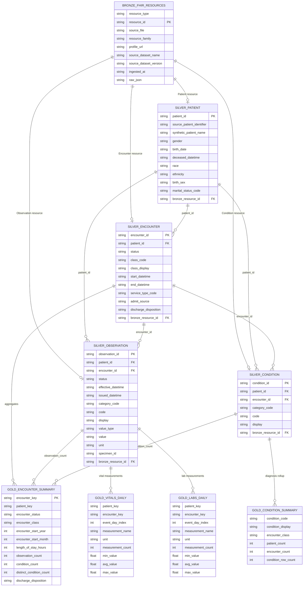

# Table Schema And Lineage

This page summarizes the core analytical schema produced by the local Parquet
pipeline and mirrored in the Databricks/Spark/Delta cloud implementation.

The schema is intentionally centered on healthcare FHIR concepts: patients,
encounters, observations, conditions, audit outputs, and analytics-ready Gold
tables.

## ER Diagram

## Row Counts

| Layer | Table | Rows |
| --- | --- | ---: |
| Bronze | `fhir_resources` | 928,935 |
| Silver | `patient` | 100 |
| Silver | `encounter` | 637 |
| Silver | `observation` | 813,540 |
| Silver | `condition` | 5,051 |
| Gold | `encounter_summary` | 637 |
| Gold | `condition_summary` | 2,319 |
| Gold | `vitals_daily` | 3,986 |
| Gold | `labs_daily` | 90,719 |

## Design Notes

Bronze preserves source FHIR resources and lineage metadata. Silver tables expose
FHIR resource ids and parsed references for clinical modeling and auditability.
Gold tables replace raw resource ids with pseudonymous analytical keys and remove
raw FHIR payloads, direct source identifiers, and unnecessary row-level lineage
fields.

The relationship audit validates that populated patient and encounter references
resolve before Gold tables rely on those joins. Missing Observation encounter
references are reported separately because some FHIR Observation resources can be
valid without encounter context.
