# Table Schema And Lineage

This page summarizes the core analytical schema produced by the local Parquet
pipeline and mirrored in the Databricks/Spark/Delta cloud implementation.

The schema is intentionally centered on healthcare FHIR concepts: patients,
encounters, observations, conditions, medication catalog/order/event resources,
procedures, audit outputs, and analytics-ready Gold tables.

## ER Diagram

```mermaid
erDiagram
    BRONZE_FHIR_RESOURCES {
        string resource_type
        string resource_id PK
        string source_file
        string resource_family
        string profile_url
        string source_dataset_name
        string source_dataset_version
        string ingested_at
        string raw_json
    }

    SILVER_PATIENT {
        string patient_id PK
        string source_patient_identifier
        string synthetic_patient_name
        string gender
        string birth_date
        string deceased_datetime
        string race
        string ethnicity
        string birth_sex
        string marital_status_code
        string source_file
        string resource_family
        string profile_url
        string source_dataset_name
        string source_dataset_version
        string bronze_ingested_at
        string bronze_resource_id FK
    }

    SILVER_ENCOUNTER {
        string encounter_id PK
        string patient_id FK
        string status
        string class_code
        string class_display
        string start_datetime
        string end_datetime
        string service_type_code
        string admit_source
        string discharge_disposition
        string discharge_disposition_display
        string source_file
        string resource_family
        string profile_url
        string source_dataset_name
        string source_dataset_version
        string bronze_ingested_at
        string bronze_resource_id FK
    }

    SILVER_OBSERVATION {
        string observation_id PK
        string patient_id FK
        string encounter_id FK
        string status
        string effective_datetime
        string issued_datetime
        string category_code
        string category_system
        string category_display
        string code
        string code_system
        string display
        string value_type
        string value
        string unit
        string specimen_id
        string source_file
        string resource_family
        string profile_url
        string source_dataset_name
        string source_dataset_version
        string bronze_ingested_at
        string bronze_resource_id FK
    }

    SILVER_CONDITION {
        string condition_id PK
        string patient_id FK
        string encounter_id FK
        string category_code
        string category_system
        string category_display
        string code
        string code_system
        string display
        string source_file
        string resource_family
        string profile_url
        string source_dataset_name
        string source_dataset_version
        string bronze_ingested_at
        string bronze_resource_id FK
    }

    SILVER_MEDICATION {
        string medication_id PK
        string medication_code
        string medication_code_system
        string medication_display
        string medication_text
        string form_code
        string form_display
        boolean is_mix
        int identifier_count
        int ingredient_count
        string source_file
        string resource_family
        string profile_url
        string source_dataset_name
        string source_dataset_version
        string bronze_ingested_at
        string bronze_resource_id FK
    }

    SILVER_MEDICATION_INGREDIENT {
        string medication_id FK
        int ingredient_index
        string ingredient_medication_id FK
        string ingredient_code
        string ingredient_code_system
        string ingredient_display
        float strength_numerator_value
        string strength_numerator_unit
        float strength_denominator_value
        string strength_denominator_unit
        string source_file
        string resource_family
        string profile_url
        string source_dataset_name
        string source_dataset_version
        string bronze_ingested_at
        string bronze_resource_id FK
    }

    SILVER_MEDICATION_REQUEST {
        string medication_request_id PK
        string patient_id FK
        string encounter_id FK
        string status
        string intent
        string authored_datetime
        string medication_id FK
        string medication_code
        string medication_code_system
        string medication_display
        string medication_source_type
        string route_code
        string route_display
        float dose_value
        string dose_unit
        string frequency
        float period
        string period_unit
        string validity_start_datetime
        string validity_end_datetime
        int dosage_instruction_count
        string source_file
        string resource_family
        string profile_url
        string source_dataset_name
        string source_dataset_version
        string bronze_ingested_at
        string bronze_resource_id FK
    }

    SILVER_MEDICATION_ADMINISTRATION {
        string medication_administration_id PK
        string patient_id FK
        string encounter_id FK
        string medication_request_id FK
        string status
        string category_code
        string category_display
        string effective_start_datetime
        string effective_end_datetime
        string medication_code
        string medication_code_system
        string medication_display
        float dose_value
        string dose_unit
        string method_code
        string method_display
        string source_system
        boolean has_request_reference
        boolean has_encounter_context
        string source_file
        string resource_family
        string profile_url
        string source_dataset_name
        string source_dataset_version
        string bronze_ingested_at
        string bronze_resource_id FK
    }

    SILVER_MEDICATION_DISPENSE {
        string medication_dispense_id PK
        string patient_id FK
        string encounter_id FK
        string medication_request_id FK
        string status
        string when_handed_over_datetime
        string medication_code
        string medication_code_system
        string medication_display
        string medication_text
        int authorizing_prescription_count
        string route_code
        string route_display
        string frequency
        float period
        string period_unit
        string source_system
        boolean has_request_reference
        string source_file
        string resource_family
        string profile_url
        string source_dataset_name
        string source_dataset_version
        string bronze_ingested_at
        string bronze_resource_id FK
    }

    SILVER_MEDICATION_STATEMENT {
        string medication_statement_id PK
        string patient_id FK
        string encounter_id FK
        string status
        string date_asserted_datetime
        string medication_code
        string medication_code_system
        string medication_display
        string medication_text
        string source_system
        string source_file
        string resource_family
        string profile_url
        string source_dataset_name
        string source_dataset_version
        string bronze_ingested_at
        string bronze_resource_id FK
    }

    SILVER_PROCEDURE {
        string procedure_id PK
        string patient_id FK
        string encounter_id FK
        string status
        string performed_start_datetime
        string performed_end_datetime
        string category_code
        string category_display
        string procedure_code
        string procedure_code_system
        string procedure_display
        string body_site_code
        string body_site_display
        string source_system
        string source_file
        string resource_family
        string profile_url
        string source_dataset_name
        string source_dataset_version
        string bronze_ingested_at
        string bronze_resource_id FK
    }

    GOLD_ENCOUNTER_SUMMARY {
        string encounter_key PK
        string patient_key
        string encounter_status
        string encounter_class
        int encounter_start_year
        int encounter_start_month
        int length_of_stay_hours
        int observation_count
        int condition_count
        int distinct_condition_count
        int medication_request_count
        int medication_administration_count
        int medication_dispense_count
        int medication_statement_count
        int procedure_count
        int distinct_medication_count
        int distinct_procedure_count
        string discharge_disposition
    }

    GOLD_CONDITION_SUMMARY {
        string condition_code
        string condition_display
        string encounter_class
        string encounter_class_display
        int patient_count
        int encounter_count
        int condition_row_count
    }

    GOLD_VITALS_DAILY {
        string patient_key
        string encounter_key
        int event_day_index
        string measurement_name
        string unit
        int measurement_count
        float min_value
        float avg_value
        float max_value
    }

    GOLD_LABS_DAILY {
        string patient_key
        string encounter_key
        int event_day_index
        string measurement_name
        string unit
        int measurement_count
        float min_value
        float avg_value
        float max_value
    }

    GOLD_MEDICATION_ACTIVITY {
        string medication_code
        string medication_display
        string activity_type
        string source_system
        string encounter_class
        string encounter_class_display
        int patient_count
        int encounter_count
        int event_count
        int with_encounter_context_count
        int without_encounter_context_count
    }

    GOLD_MEDICATION_ORDER_FULFILLMENT {
        string medication_request_key PK
        string patient_key
        string encounter_key
        string medication_code
        string medication_display
        string request_status
        string request_intent
        int authored_year
        int administration_count
        int dispense_count
        string first_administration_datetime
        string first_dispense_datetime
        boolean has_administration
        boolean has_dispense
        string fulfillment_path
    }

    GOLD_PROCEDURE_SUMMARY {
        string procedure_code
        string procedure_display
        string source_system
        string encounter_class
        string encounter_class_display
        int patient_count
        int encounter_count
        int procedure_count
        int with_body_site_count
    }

    BRONZE_FHIR_RESOURCES ||--o| SILVER_PATIENT : "Patient resource"
    BRONZE_FHIR_RESOURCES ||--o| SILVER_ENCOUNTER : "Encounter resource"
    BRONZE_FHIR_RESOURCES ||--o| SILVER_OBSERVATION : "Observation resource"
    BRONZE_FHIR_RESOURCES ||--o| SILVER_CONDITION : "Condition resource"
    BRONZE_FHIR_RESOURCES ||--o| SILVER_MEDICATION : "Medication resource"
    BRONZE_FHIR_RESOURCES ||--o| SILVER_MEDICATION_REQUEST : "MedicationRequest resource"
    BRONZE_FHIR_RESOURCES ||--o| SILVER_MEDICATION_ADMINISTRATION : "MedicationAdministration resource"
    BRONZE_FHIR_RESOURCES ||--o| SILVER_MEDICATION_DISPENSE : "MedicationDispense resource"
    BRONZE_FHIR_RESOURCES ||--o| SILVER_MEDICATION_STATEMENT : "MedicationStatement resource"
    BRONZE_FHIR_RESOURCES ||--o| SILVER_PROCEDURE : "Procedure resource"

    SILVER_PATIENT ||--o{ SILVER_ENCOUNTER : "patient_id"
    SILVER_PATIENT ||--o{ SILVER_OBSERVATION : "patient_id"
    SILVER_PATIENT ||--o{ SILVER_CONDITION : "patient_id"
    SILVER_PATIENT ||--o{ SILVER_MEDICATION_REQUEST : "patient_id"
    SILVER_PATIENT ||--o{ SILVER_MEDICATION_ADMINISTRATION : "patient_id"
    SILVER_PATIENT ||--o{ SILVER_MEDICATION_DISPENSE : "patient_id"
    SILVER_PATIENT ||--o{ SILVER_MEDICATION_STATEMENT : "patient_id"
    SILVER_PATIENT ||--o{ SILVER_PROCEDURE : "patient_id"
    SILVER_ENCOUNTER ||--o{ SILVER_OBSERVATION : "encounter_id"
    SILVER_ENCOUNTER ||--o{ SILVER_CONDITION : "encounter_id"
    SILVER_ENCOUNTER ||--o{ SILVER_MEDICATION_REQUEST : "encounter_id"
    SILVER_ENCOUNTER ||--o{ SILVER_MEDICATION_ADMINISTRATION : "encounter_id"
    SILVER_ENCOUNTER ||--o{ SILVER_MEDICATION_DISPENSE : "encounter_id"
    SILVER_ENCOUNTER ||--o{ SILVER_MEDICATION_STATEMENT : "encounter_id"
    SILVER_ENCOUNTER ||--o{ SILVER_PROCEDURE : "encounter_id"
    SILVER_MEDICATION ||--o{ SILVER_MEDICATION_INGREDIENT : "ingredient parent"
    SILVER_MEDICATION ||--o{ SILVER_MEDICATION_REQUEST : "medication_id"
    SILVER_MEDICATION_REQUEST ||--o{ SILVER_MEDICATION_ADMINISTRATION : "medication_request_id"
    SILVER_MEDICATION_REQUEST ||--o{ SILVER_MEDICATION_DISPENSE : "medication_request_id"

    SILVER_ENCOUNTER ||--o{ GOLD_ENCOUNTER_SUMMARY : "aggregates"
    SILVER_OBSERVATION ||--o{ GOLD_ENCOUNTER_SUMMARY : "observation_count"
    SILVER_CONDITION ||--o{ GOLD_ENCOUNTER_SUMMARY : "condition_count"
    SILVER_MEDICATION_REQUEST ||--o{ GOLD_ENCOUNTER_SUMMARY : "medication_request_count"
    SILVER_MEDICATION_ADMINISTRATION ||--o{ GOLD_ENCOUNTER_SUMMARY : "medication_administration_count"
    SILVER_MEDICATION_DISPENSE ||--o{ GOLD_ENCOUNTER_SUMMARY : "medication_dispense_count"
    SILVER_MEDICATION_STATEMENT ||--o{ GOLD_ENCOUNTER_SUMMARY : "medication_statement_count"
    SILVER_PROCEDURE ||--o{ GOLD_ENCOUNTER_SUMMARY : "procedure_count"
    SILVER_CONDITION ||--o{ GOLD_CONDITION_SUMMARY : "diagnosis rollup"
    SILVER_OBSERVATION ||--o{ GOLD_VITALS_DAILY : "vital measurements"
    SILVER_OBSERVATION ||--o{ GOLD_LABS_DAILY : "lab measurements"
    SILVER_MEDICATION_REQUEST ||--o{ GOLD_MEDICATION_ACTIVITY : "request activity"
    SILVER_MEDICATION_ADMINISTRATION ||--o{ GOLD_MEDICATION_ACTIVITY : "administration activity"
    SILVER_MEDICATION_DISPENSE ||--o{ GOLD_MEDICATION_ACTIVITY : "dispense activity"
    SILVER_MEDICATION_STATEMENT ||--o{ GOLD_MEDICATION_ACTIVITY : "statement activity"
    SILVER_MEDICATION_REQUEST ||--o{ GOLD_MEDICATION_ORDER_FULFILLMENT : "request fulfillment"
    SILVER_PROCEDURE ||--o{ GOLD_PROCEDURE_SUMMARY : "procedure rollup"
```

## Row Counts

| Layer | Table | Rows |
| --- | --- | ---: |
| Bronze | `fhir_resources` | 928,935 |
| Silver | `patient` | 100 |
| Silver | `encounter` | 637 |
| Silver | `observation` | 813,540 |
| Silver | `condition` | 5,051 |
| Silver | `medication` | 1,794 |
| Silver | `medication_ingredient` | 634 |
| Silver | `medication_request` | 17,552 |
| Silver | `medication_administration` | 56,535 |
| Silver | `medication_dispense` | 15,375 |
| Silver | `medication_statement` | 2,411 |
| Silver | `procedure` | 3,450 |
| Gold | `encounter_summary` | 637 |
| Gold | `condition_summary` | 2,319 |
| Gold | `vitals_daily` | 3,986 |
| Gold | `labs_daily` | 90,719 |
| Gold | `medication_activity` | 7,160 |
| Gold | `medication_order_fulfillment` | 17,552 |
| Gold | `procedure_summary` | 536 |

## Design Notes

Bronze preserves source FHIR resources and lineage metadata. Silver tables expose
FHIR resource ids and parsed references for clinical modeling and auditability,
including medication catalog references and medication request/event links. Gold
tables replace raw resource ids with pseudonymous analytical keys and remove raw
FHIR payloads, direct source identifiers, and unnecessary row-level lineage
fields.

The relationship audit validates that populated patient, encounter, medication,
and medication request references resolve before Gold tables rely on those joins.
Missing Observation encounter references and missing medication order links are
reported separately because those gaps reflect valid source coverage limits
rather than orphaned references.
